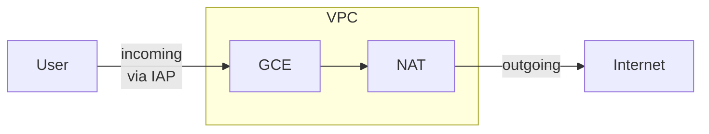

# まえがき
会社(特に大きな企業)であるサービスのツールを導入したいが､セキュリティ要件を満たしていないのでVMを立てて､
そこで運用という流れがたまに発生します｡
特に個人データやソースコードのアップロードが関わってくるとこういったケースになるパターンが多いです｡

## 遵守事項

- 特定の組織のユーザのみをアクセス可能にする
- グローバルネットワークにアクセス経路を公開しない
- アクセスログを追跡したい

## 解決策

超簡素な解決法ですが､これが一番ラクでとっつきやすいと思います｡

:::message
IAPでアクセスを許可する前に､Firewallルールで指定ポートを許可する必要があります｡
:::

## 理解しておくこと

- ユーザはサービスにアクセスするために､gcloudコマンドでトンネリングを実施する必要がある(体験として微妙)
- ほんとにしっかり使うなら不適
- VPCのフローログを取れば､通信のタイミングは監視可能

> GCEにはブラウザSSHできるのですが､これのHTTPS版機能をつけてもらえると､楽になるんですけどね
